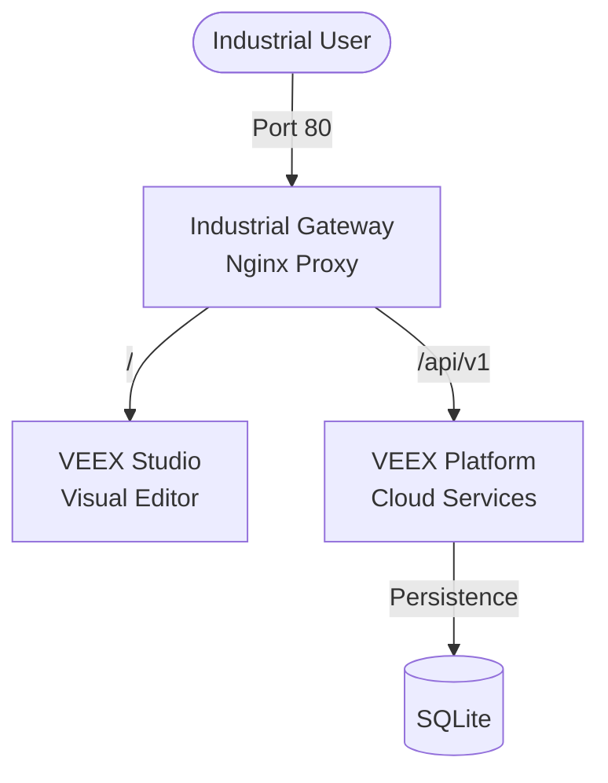

# VEEX Deploy

Official deployment and distribution repository for the VEEX Industrial IoT Platform.

## Quick Start

### All-in-One Docker (Recommended for Testing)

```bash
cd docker/all-in-one
docker-compose up -d
```

Access (Unified Gateway):
- **Studio** (Visual Editor): http://localhost/
- **Platform** (Registry API): http://localhost/api/v1
- **Dashboard** (Telemetry): http://localhost/dashboard

### Production Kubernetes

```bash
cd kubernetes/helm-chart
helm install veex ./veex-chart
```

## Deployment Options

### 🐳 Docker

- **[all-in-one](docker/all-in-one/)** - Single-command demo/dev setup (Platform + Studio)
- **[production](docker/production/)** - Multi-container production stack with monitoring
- **[development](docker/development/)** - Local development environment

### ☸️ Kubernetes

- **[helm-chart](kubernetes/helm-chart/)** - Official Helm chart (recommended)
- **[manifests](kubernetes/manifests/)** - Raw YAML manifests for custom deployments

### ☁️ Cloud Providers

- **[AWS](cloud/aws/)** - Terraform templates for ECS/EKS
- **[Azure](cloud/azure/)** - ARM templates for AKS
- **[GCP](cloud/gcp/)** - GKE deployment configurations

### 🖥️ Bare Metal

- **[Ansible](bare-metal/ansible/)** - Automated on-premise installation playbooks

## Architecture



## Documentation

- [Quick Start Guide](docs/quick-start.md)
- [Production Deployment](docs/production-deployment.md)
- [Security Best Practices](docs/security.md)
- [Troubleshooting](docs/troubleshooting.md)
- [Backup & Recovery](docs/backup.md)

## Requirements

### Minimum (All-in-One)
- Docker 20.10+
- Docker Compose 2.0+
- 2GB RAM
- 10GB Storage

### Production (Kubernetes)
- Kubernetes 1.24+
- 4GB RAM per node
- 50GB Storage (PVC)

## Support

- **Documentation**: [veex-docs](https://github.com/veex-platform/veex-docs)
- **Issues**: [GitHub Issues](https://github.com/veex-platform/veex-deploy/issues)
- **Discussions**: [GitHub Discussions](https://github.com/veex-platform/veex-deploy/discussions)

## License

Apache 2.0 - See [LICENSE](LICENSE) for details.
